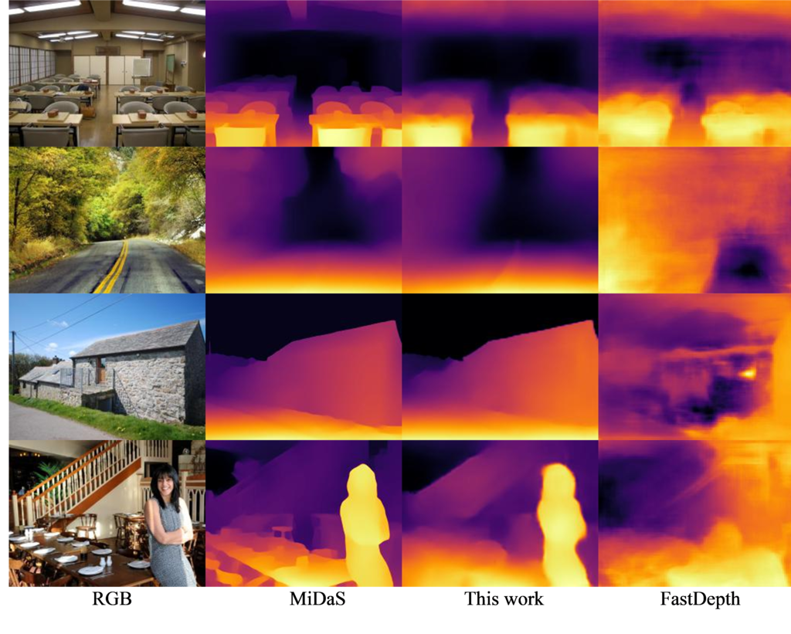

# Monocular Depth Estimation in Real-Time on Embedded System
This repository contains a trained model and the code for my research project in deep learning.

## Purpose
The goal of this project is to develop a deep learning model able to compute depth from a single image. The main constraint is a lightweight architecture that enable real-time inference on NVIDIA Jetson TX2 CPU.

This work is based on [FastDepth](https://arxiv.org/abs/1903.03273) and a [distillation strategy](https://arxiv.org/abs/2006.05724) using [MiDaS](https://arxiv.org/abs/2103.13413) as teacher.




## Model

The FastDepth model used is MobileNet-NNConv5(depthwise), with additive skip connections.
The main modification consists in the replacement of the encoder with MobileNetV3-Large. The skip connection are also revisited taking into account the different encoder architecture.
Moreover, feature upsampling through the nearest neighbour operator in the decoder phase have been replaced with bilinear interpolation.

## Dataset
The distillation strategy consists in using a large collection of images to generate proxy labels with a robost model like MiDaS.
The [Places dataset](http://places2.csail.mit.edu/) may be an appropriate image collection because of the multitude of environment categories (indoor and outdoor) and the sheer size of the dataset (more than 10 million images).
For training purposes only 450 000 were selected randomly. The images were first resized and then randomly cropped to have a resolution of 512x384.
Once the depth map have been generated through MiDaS a further resize was done to bring the resolution of both the image and depth map to 256x192, which is the input size of the lightweight model. It has taken 20+ hours to generate the depth maps using NVIDIA Tesla P100 GPU.

## Results
Comparison against prior work and the teacher (MiDaS) on NYU Depth test split
| Rete      | Input size | Training Dataset |  Abs Rel  |  Sq Rel   | RMSE	log  |   RMSE    | $δ<1.25$ | $δ<1.25^2$ | $δ<1.25^3$ |
| --------- | :--------: | :--------------: | :-------: | :-------: | :-------: | :-------: | :--------: | :---------: | :---------: |
| MiDaS     |  512x384   |       MIX        |   0.091   |   0.058   |   0.391   |   0.121   |   0.919    |    0.987    |    0.997    |
| FastDepth |  224x224   |       NYU        |   0.165   |   0.154   |   0.604   |   0.208   |   0.771    |    0.937    |    0.980    |
| PydNet    |  640x320   |       WILD       |   0.130   |   0.091   |   0.493   |   0.168   |   0.827    |    0.969    |    0.994    |
| FastDepth |  640x320   |       WILD       |   0.129   |   0.090   |   0.492   |   0.167   |   0.833    |    0.971    |    0.994    |
| This Work |  256x192   |      Places      | **0.115** | **0.077** | **0.449** | **0.150** | **0.867**  |  **0.976**  |  **0.995**  |

## Usage
- Download NYU Depth V2 test split
```
cd nyu_depth_v2
wget http://horatio.cs.nyu.edu/mit/silberman/nyu_depth_v2/nyu_depth_v2_labeled.mat
wget http://horatio.cs.nyu.edu/mit/silberman/indoor_seg_sup/splits.mat
```

- To evaluate run:
```
python main.py --config config/config.yaml
```


## References


- Wofk, D., Ma, F., Yang, T.J., Karaman, S., & Sze, V. (2019). FastDepth: Fast Monocular Depth Estimation on Embedded Systems. In IEEE International Conference on Robotics and Automation (ICRA).

- René Ranftl, Katrin Lasinger, David Hafner, Konrad Schindler, & Vladlen Koltun (2022). Towards Robust Monocular Depth Estimation: Mixing Datasets for Zero-Shot Cross-Dataset Transfer. IEEE Transactions on Pattern Analysis and Machine Intelligence, 44(3).

- Rene Ranftl, Alexey Bochkovskiy, & Vladlen Koltun (2021). Vision Transformers for Dense Prediction. ICCV.

- Aleotti, F., Zaccaroni, G., Bartolomei, L., Poggi, M., Tosi, F., & Mattoccia, S. (2021). Real-time single image depth perception in the wild with handheld devices. Sensors, 21.

- Zhou, B., Lapedriza, A., Khosla, A., Oliva, A., & Torralba, A. (2017). Places: A 10 million Image Database for Scene Recognition. IEEE Transactions on Pattern Analysis and Machine Intelligence.